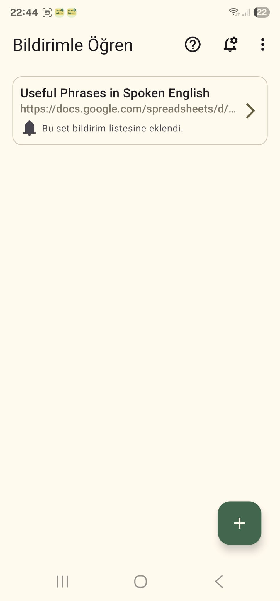
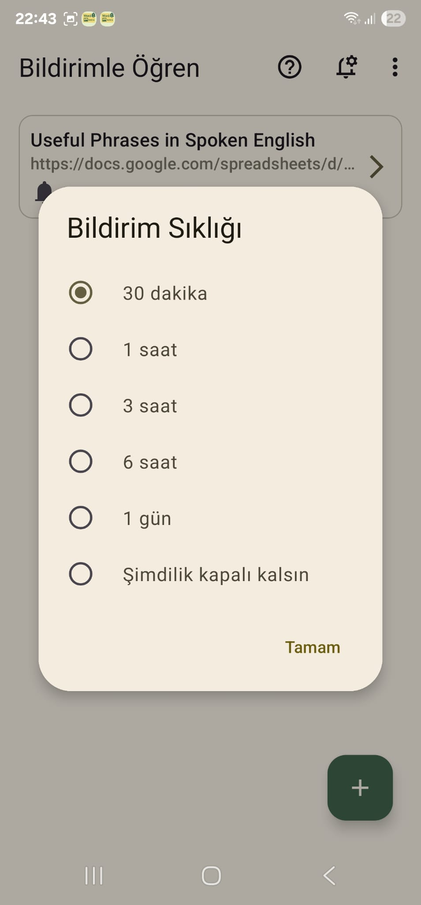
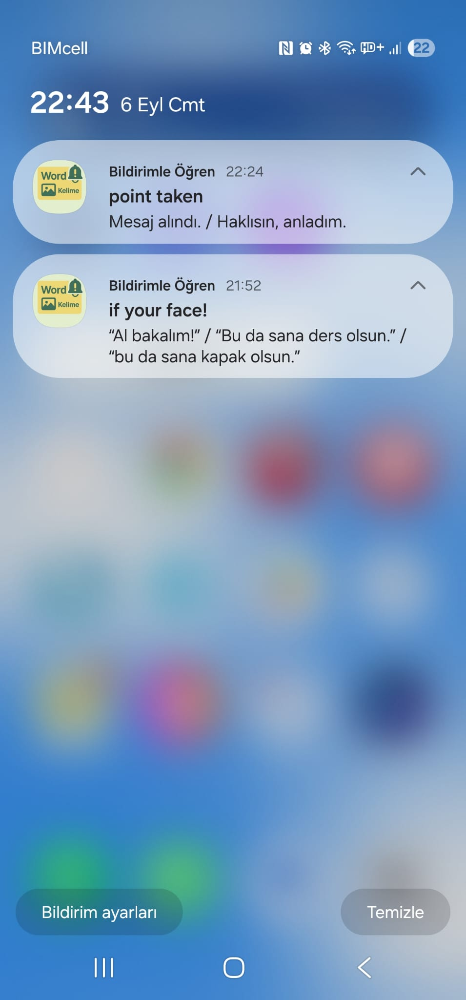
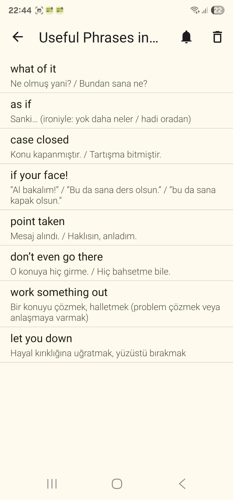

# Bildirimle Öğren / Learn with Notifications

🇹🇷 Türkçe: Kullanıcılara bildirimlerle kelime öğrenmeyi sağlayan Android uygulaması.  
🇬🇧 English: Android app to learn languages with scheduled notifications.  

---

## 📱 Screenshots

  
  
  
  

---

## 🚀 Features

- Learn vocabulary and sentences with scheduled notifications.
- Customize notification frequency.
- Multiple language sets supported.
- Simple and clean Material 3 design.
- Uses **Flow** for reactive data handling.

---

## 🛠️ Technologies & Libraries

- **Kotlin** – Main programming language.
- **Android SDK** – Target SDK 36.
- **Jetpack Components**:
  - **Room** (Local Database)
  - **WorkManager** (Notifications)
  - **ViewModel + Flow**
  - **Navigation Component**
- **DataStore Preferences** – Local key-value storage.
- **Dagger Hilt** – Dependency Injection.
- **Kotlinx Serialization** – JSON parsing.
- **Material 3** – Modern UI components.
- **OpenCSV** – CSV parsing.
- **KTX Extensions** – `activity-ktx`, `fragment-ktx`, `lifecycle-runtime-ktx`.
- **ConstraintLayout** – Flexible layouts.

---

## 📄 Usage

1. Prepare a vocabulary list in **Google Sheets** (either your own or someone else’s).  
2. In Google Sheets, select **File → Share → Publish to web** and copy the generated link.  
3. Open the app and paste the link inside the **Add Set** section.  
4. The app will download the dataset to your phone.  
5. Enable notifications for that set.  
6. Learn new words through scheduled notifications.

---

## 📂 File Structure

- `data/` – Room entities, DAO, Repository.
- `ui/` – Activities and Fragments.
- `notification/` – WorkManager worker for notifications.
- `di/` – Hilt modules.
- `screenshots/` – App screenshots used in README.

---

## 📝 License

MIT License © 2025 Levent YADIRGA

